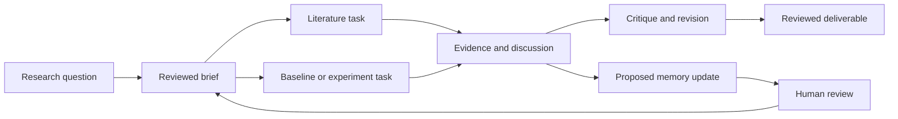

<p align="center">
  <picture>
    <source media="(prefers-color-scheme: dark)" srcset="public/assets/verifold-horizontal-dark.webp" />
    
  </picture>
</p>

<p align="center"><strong>Research beyond the paper plane.</strong></p>

<p align="center">
  <a href="https://github.com/MVPandey/Verifold/actions/workflows/validate.yml"></a>
  <a href=".nvmrc"></a>
  <a href="tsconfig.json"></a>
  <a href="#project-status"></a>
</p>

# Verifold

Verifold coordinates computational research through the coding harnesses you already use.

Start with **“What do you want to work on?”** Your installed Claude Code or Codex asks follow-up questions, drafts a brief for review, and researches the approved scope. Verifold creates a project in your chosen directory and saves the brief, sources, research directions, and feedback.

We're building toward a research **meta-harness**: a shared workspace that coordinates several harness instances from ideation to a paper, repository, figure, proof, or other deliverable. Each harness keeps its models, credentials, tools, and permissions. Verifold will connect their tasks, discussions, memory, and evidence across sessions.

[Install](#install-the-cli) · [Usage](#start-a-research-project) · [Current capabilities](#project-status) · [Roadmap](#development-plan) · [Contribute](#help-build-verifold)

## Install the CLI

Use Node 22, 24, or 26 and an installed, authenticated Claude Code or Codex harness. Use the latest patch release of your chosen major:

```sh
npm install -g verifold
verifold init
```

You can also run `npx verifold init` or install locally with `npm install verifold`. A local installation runs through `npx verifold`.

Verifold starts the selected harness with its existing configuration and permissions. See [security boundaries](SECURITY.md).

## Start a research project

Run `verifold init` from your terminal. Follow the prompts to choose a harness, review your research brief, and select a project directory.

Run subsequent commands from that project directory, or add `--workspace <path>`:

```sh
verifold research --feedback "Focus on methods that run on one GPU."
verifold research --approve
verifold status
verifold select
```

`init` starts with **“What do you want to work on?”**, then connects to Claude Code or Codex with its default model or one you choose. Verifold remembers the harness preference in a private agency directory.

The selected harness asks one follow-up at a time, using your answers and any saved background. Its prompt asks it to reason from first principles: why the problem matters, what assumptions need testing, what evidence would change your mind, and what scope is feasible. It asks about experience and constraints when needed. There is no fixed research questionnaire. The agent writes Markdown, not a required JSON brief. The conversation has up to six turns, with one explicit retry per failed turn. Press Enter or type `/finish` at a follow-up to request the brief early. If a reply fails, retry with your answers intact or review a local brief made from those answers.

Review the full research brief, press Enter to accept it, enter feedback to revise it, or type `/cancel` to stop. Then specify your project directory and choose guided or autonomous exploration. `--workspace path` supplies the directory directly. Relative paths resolve against the directory where you launched Verifold; the interactive path also accepts `~/`. Missing directories are created. Existing folder contents are preserved; conflicting files, a preexisting `.verifold.md`, and linked scaffold directories are rejected.

Every initialized project receives:

```text
project/
  .verifold.md   Research brief, folder guide, and continuation commands
  .verifold/     Private state, research attempts, and source reports
  literature/   Papers, source notes, and provenance
  experiments/  Reproducible code and configurations
  results/      Raw outputs, metrics, and negative results
  figures/      Plots and regeneration scripts
  docs/         Plans, decisions, methods, and write-ups
  agents/       Project agent briefs and review notes
```

If the selected directory contains supported top-level documentation, Verifold offers an investigation before project creation. With consent, the agent receives a bounded selection of top-level README, agent-instruction, and manifest files. You review the resulting brief; declining or a failed investigation preserves your original brief. Accepted context stays in the project’s `.verifold.md` and workspace state, not your personal profile. This is documentation-based context, not a source-code audit.

The approved brief feeds planning and research in the selected directory. It stays project-scoped; onboarding does not automatically turn it into a reusable personal profile. Run subsequent commands from that directory or pass `--workspace path`.

Use arrow keys or number keys in the harness and research-mode menus. Press Enter to accept, or Escape to cancel. Simple terminals offer numbered text prompts.

When no approved background exists, interactive `init` offers an optional profile step after your research question and harness selection. Choose “Learn from my chats” to select a local chat file or folder, import one memory file, write an introduction locally, or skip. The chat option suggests the selected harness’s usual local session folder; you can choose a narrower folder or an export instead. `init --setup-only` also offers an agent interview to build a reusable profile.

Imports require permission before reading and sending the text to the harness. You review the Markdown before saving it as `~/.verifold/agency/USER.md`; `settings.json` stores harness preferences. `--agency-dir path` selects an empty directory or an existing Verifold agency.

Later onboarding reuses this approved background without repeating profile questions or rereading its source. Edit or delete `USER.md` to change future reuse; existing project briefs and host records remain.

Chat sampling inspects at most 200 directory entries and ten files, with a 256 KB per-file limit and 512 KB total. It skips links, hidden subdirectories, oversized files, and unsupported native records. Native JSONL imports retain recognized user-role messages, excluding model responses, tool results, and subagent folders. User-role records can still include harness-injected context; review the profile’s inferences. Ordinary text and JSON exports are supplied as selected. Local storage does not imply offline model processing.

The coordinator proposes a search scope and personas. Guided mode pauses for approval. Use `research --feedback` to revise that plan, then `research --approve` to continue. The harness researches the approved scope and returns sources and directions. Initial research does not require PDF downloads.

After directions are available, use `research --feedback` to refine them through the saved coordinator session. `select` asks for an explicit idea ID. Noninteractive selection requires `select --id <idea-id>`. Selection does not start a pilot or experiment.

Autonomous mode proceeds through planning and research, then stops at directions. It preserves the host's tool permissions.

Interactive `init` and `research` show readable results and next steps. Noninteractive runs and `status` return JSON. Interactive mode requires a terminal on stdin and stderr; use `status` when piping saved state to another tool.

Noninteractive initialization requires explicit research inputs. The harness drafts a brief with unknowns from these inputs, then plans and researches without an interview or brief-review prompt:

```sh
verifold init --host claude --topic "Efficient graph algorithms" --autonomy autonomous
# Optional: --model <host-model-id> --agency-dir <private-directory>
```

Use `--host codex` to select Codex. Paths resolve against the current directory. Add `--workspace <path>` to select another project directory.

### Setup and request commands

Use `init --setup-only` to save harness preferences and optionally review context without starting research. Existing `--profile profile.json` imports remain supported as project-scoped legacy profiles:

```sh
verifold init --setup-only --profile profile.json --host codex
verifold recommend
verifold ideas --from ideas.json
verifold select
verifold literature --memory
verifold handoff
verifold view
```

`recommend` prints a host request. `ideas --from` imports an array with `id`, `title`, `recommendation`, and a nonempty `gates` array.

After selection, `literature` prints an optional retention request. `--memory` also requests a Markdown memory file with source-to-file mappings. Both forms only print instructions. They do not invoke the harness or verify downloads. Official citation exports must remain separate from generated summaries.

`handoff` prints a pilot-planning request for the host and Automative. The user must approve scope, evaluator, budget, and gates before execution. Verifold does not execute Automative in this version.

### Local research desk

Run `verifold ui --workspace <path>` to open a read-only browser desk for an initialized project. Keep that terminal open; Ctrl+C stops the server. Use `--no-open` to print the URL without launching a browser. The URL includes a private access token. Keep it private and use the complete URL if the desk asks you to reconnect.

The desk shows the question, saved context, research phase, attempt history, source reports, and next CLI command. It refreshes every two seconds. Run research in another terminal; opening or refreshing the desk does not launch a harness. Research controls remain in the CLI.

Recent activity means the research owner wrote an observation within ten seconds. It does not prove that a native worker is alive. The adapters expose lifecycle and final output, not live tool output. Requested models, returned session IDs, and host-reported delegation remain distinct from independently observed behavior.

## Privacy and website

Project state stays in `.verifold/workspace.json`. Research attempts keep briefs, responses, and reports under `.verifold/runs/<attempt-id>/`. These files can contain private research information.

Initialization adds `/.verifold/` and `/.verifold.md` to the workspace's `.gitignore` and creates state with private permissions. This prevents ordinary accidental staging. It does not prevent intentional publication or access by processes under the same account.

The selected harness uses its configured model services and research tools. Local state does not imply that those services run offline. Verifold creates no remote profile or publication.

`ui` serves only the selected project on loopback, with authenticated project reads and bundled assets. It rejects unexpected hosts and origins. It does not expose raw harness transcripts or arbitrary files. `view` creates a read-only local HTML snapshot with no external assets. The Vite website explains the CLI entry point. Remote profile synchronization remains future work. The nested `verifold-website/` repository remains independent.

## Project status

This README describes the current source checkout. The published npm package can lag changes that have not been released.

| Available in this checkout | What it does                                                                                        |
| -------------------------- | --------------------------------------------------------------------------------------------------- |
| Adaptive onboarding        | Asks one question at a time through your chosen harness and lets you review the research brief.     |
| Project initialization     | Creates `.verifold.md` and folders for literature, experiments, results, figures, docs, and agents. |
| Landscape research         | Saves planning, source links, proposed directions, and feedback; you explicitly select an idea.     |
| Reviewed background        | Imports one selected text export with consent and review through setup-only personalization.        |
| Local research records     | Retains attempt files and provides CLI status plus a read-only HTML snapshot.                       |

This is an early implementation. Native delegation is requested and reported by the host, not independently verified by Verifold.

Optional literature retention and pilot handoff commands produce requests for the host. They do not download PDFs, create a literature memory file, or run experiments. Live multi-agent supervision, scheduled memory, public collaboration, Automative execution, and cloud synchronization remain planned work.

## Development plan

Start with a local Node app that opens a browser tab, then add coordination. CLI and browser will use the same project operations. Native desktop packaging is outside the current plan.

| Priority                    | Planned outcome                                                                                                   | Work                                                                                                                                                                                                                                                                  |
| --------------------------- | ----------------------------------------------------------------------------------------------------------------- | --------------------------------------------------------------------------------------------------------------------------------------------------------------------------------------------------------------------------------------------------------------------- |
| First                       | Watch one real harness run, inspect its evidence, and recover its recorded state after reconnecting.              | [Local research desk #15](https://github.com/MVPandey/Verifold/issues/15)                                                                                                                                                                                             |
| Small parallel improvements | Offer reviewed background, inspect scoped Markdown context, and diagnose installed harnesses without model calls. | [Profile import #16](https://github.com/MVPandey/Verifold/issues/16), [memory #17](https://github.com/MVPandey/Verifold/issues/17), [harness diagnostics #28](https://github.com/MVPandey/Verifold/issues/28)                                                         |
| Next                        | Choose “Continue onboarding in the CLI” or “Open the web UI” and retain the same interview.                       | [Shared onboarding #18](https://github.com/MVPandey/Verifold/issues/18)                                                                                                                                                                                               |
| Coordination                | Assign adjacent tasks, exchange evidence-linked messages, and supervise two independent harness instances.        | [Task records #19](https://github.com/MVPandey/Verifold/issues/19), [discussions #20](https://github.com/MVPandey/Verifold/issues/20), [workers #21](https://github.com/MVPandey/Verifold/issues/21), [team view #22](https://github.com/MVPandey/Verifold/issues/22) |
| Complete the research loop  | Assemble a reviewed memo, reproducible repository, and report from retained evidence.                             | [Deliverables #23](https://github.com/MVPandey/Verifold/issues/23)                                                                                                                                                                                                    |
| Inspect evidence            | Preview registered outputs and flag changed or missing files without altering the cited version.                  | [Evidence inspector #29](https://github.com/MVPandey/Verifold/issues/29), after #20/#22; does not block #23                                                                                                                                                           |
| Learn from completed work   | Propose sourced memory changes, schedule bounded maintenance, and evaluate reversible procedure improvements.     | [Memory review #24](https://github.com/MVPandey/Verifold/issues/24), [scheduling #25](https://github.com/MVPandey/Verifold/issues/25), [procedure evaluation #26](https://github.com/MVPandey/Verifold/issues/26)                                                     |
| Share selected research     | Design a public board where people and swarms can critique evidence and contribute with owner review.             | [Public board design #27](https://github.com/MVPandey/Verifold/issues/27)                                                                                                                                                                                             |

The intended coordinated workflow below is a plan, not a recorded execution:



For a small-model training competition, the target workflow connects prior work, baseline reproduction, evaluator review, ablations, negative results, and the final repo. A literature-gap memo or a proof project can use the same task and evidence model without a training score.

Memory will separate approved personal background, project decisions, and task notes. Markdown summaries will reference original evidence. Pruning active context will preserve that evidence; accepting a project summary will not silently update a personal profile. Procedure changes will require evaluation and rollback before adoption.

See the [ordered roadmap #14](https://github.com/MVPandey/Verifold/issues/14) for dependencies and acceptance criteria.

## Help build Verifold

See [open issues](https://github.com/MVPandey/Verifold/issues) for current contributions. Each issue defines its prerequisites and acceptance criteria.

The wider goal is a shared home for computational science, including math, CS/ML, and security. Researchers should be able to inspect assumptions, critique an analysis, rerun an experiment, or contribute an adjacent investigation. Failed attempts and unresolved objections belong beside successful results.

Work starts private. The planned public board will share only what the owner selects, with enough evidence for others to test and continue the investigation. Publication should preserve an inspectable record of how a conclusion was reached.

[Open an issue](https://github.com/MVPandey/Verifold/issues) with a workflow, a reproducible problem, or a contribution you want to make. Use public examples and keep private research out of the issue. For code changes, read the engineering rules below and run `make validate` before opening a pull request.

## Build from source

For development or unreleased changes, clone the repository and use its pinned Node version. With `nvm` installed:

```sh
git clone https://github.com/MVPandey/Verifold.git
cd Verifold
nvm use
npm ci
npm run build:cli
node dist-cli/cli.js init
```

In this checkout, replace `verifold` in the examples above with `node dist-cli/cli.js`. Rebuild after source changes.

## Engineering

Internal agent research, planning notes, and coordination records belong in `.local/agents/`, which Git ignores. Keep public documentation in `docs/`. Do not publish private notes through commits, issue bodies, or pull request descriptions.

Read [AGENTS.md](AGENTS.md) before contributing.
It defines the required Node.js, technical-English, and ponytail skills, plus review and validation rules.
The skill editions live in `.agents/skills/` and require no personal skill installation.

`src/cli.ts` owns process lifecycle and terminal streams. CLI command handlers coordinate research and profile operations. The harness adapter owns subprocess arguments and response parsing. Research contracts validate returned data, and storage owns atomic state changes.

Structured results use stdout. Prompts, diagnostics, the violet/lavender folded VF welcome, and activity indicators use stderr. The welcome has a brief fold highlight; selected menu rows update in place and completed choices collapse into a short transcript. Text wraps to the terminal width, including long paths and common wide Unicode characters. Short windows show a compact selector. Indicators show time spent waiting for a real harness response; they do not claim individual subagent progress. Set `VERIFOLD_REDUCED_MOTION=1` for static activity messages. `NO_COLOR` disables color and animation; `TERM=dumb` also uses numbered text menus. Noninteractive commands keep their machine-readable output.

Normal research failures preserve the saved checkpoint. Inspect `status` and the attempt files before continuing. A forced termination such as SIGKILL can leave `.verifold/research.lock`. Confirm that no research process remains active before removing it. Apply the same check to a stale `write.lock` before another state write.

New research attempts save `attempt.json` beside their evidence. It records the Verifold attempt ID, harness, requested model, starting phase, timestamps, requested session, and returned native session separately. A null model means the harness default was requested. It does not identify the resolved model.

`succeeded` means the response passed Verifold validation and the phase checkpoint was saved, not that its scientific claims were verified. `failed` and `cancelled` preserve available evidence. Inspect the checkpoint before retrying. A record left at `started` has an unknown final outcome and does not prove that a process remains alive. Older attempts have no record. The desk scans at most 200 history entries, includes the latest recorded attempt separately, and marks unreadable records as unknown. Process recovery remains manual.

`make validate` runs formatting, type-aware linting, strict types, tests, both builds, and a packed CLI consumer check. Enable the commit and push hooks in each clone:

```sh
git config --local core.hooksPath .githooks
```

See [validation scope](docs/validation.md). Source-link validation does not verify scientific claims or establish citation provenance.

The harness package is MIT licensed. The website and visual brand assets are outside that grant. See [license scope](LICENSING.md). The bundled Manrope font retains its SIL Open Font License.
